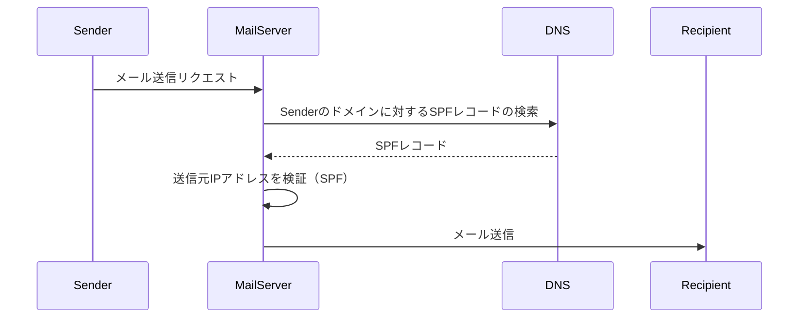
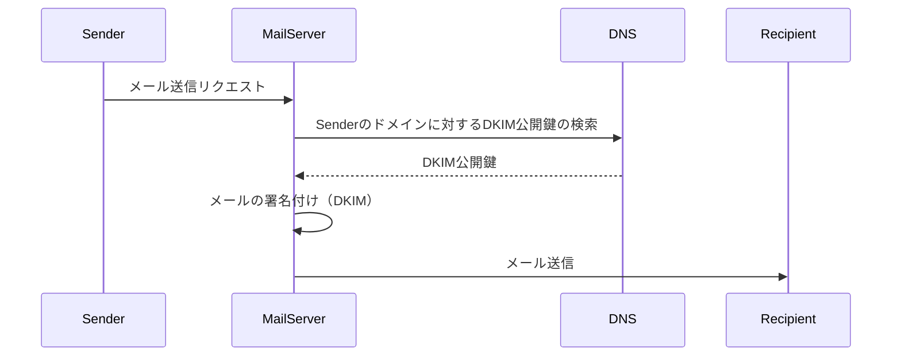
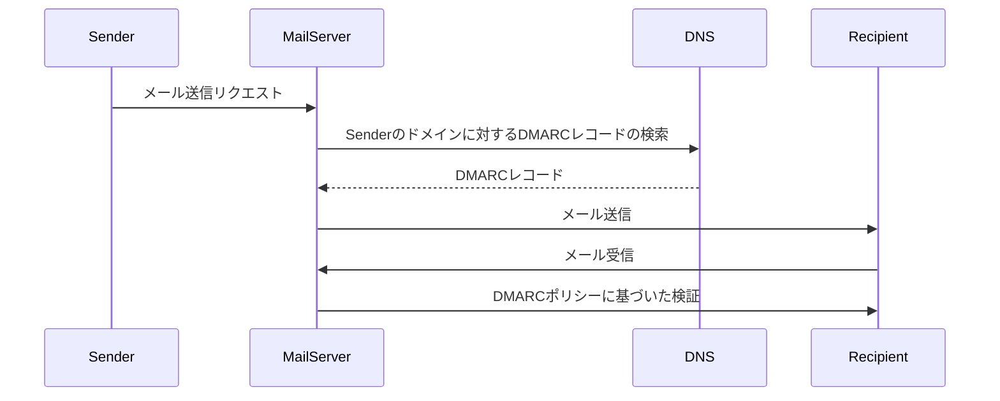

# はじめに
普段はブロックチェーン周りの記事を書くのですが、今回は詐欺の１つであるメール差出人詐欺について書きます!
簡単に変更できることを理解してもらい、認識を改める為に書いてます。

普段怪しいメールが届いた時に差出人のメールアドレスが正しいかで信頼できるメールか判断していませんか？？
それ、詰む未来が割と近いです笑

# 差出人の変更方法
:::message alert
悪用しないでください。人生ごと詰みます。
:::
今回はGmail(パソコンで操作)で説明します

#### 差出人名の変更方法
1. 画面右上の設定アイコンをクリック
2. "すべての設定を表示"をクリック
3. トップのタブから"アカウント"をクリック
4. 名前欄の"情報を変更"をクリック
5. 名前を変更し保存すれば完了

#### 差し出しメールアドレス変更方法
1. 画面右上の設定アイコンをクリック
2. "すべての設定を表示"をクリック
3. トップのタブから"アカウント"をクリック
4. "他のアカウントのメールを確認"の"メールアカウントを追加する"をクリック
5. 追加するメールアドレスを設定
6. 自分が契約したSMTPサーバーを設定すれば完了

# 差出人を調べる方法
Gmail(パソコンで操作)で説明します
1. 調べたいメールを開き、右上の３つの点のアイコンをクリック
2. "メッセージのソースを表示"をクリック
3. いっぱいなんか表示される
4. コマンドFの検索で"Received:"を検索
5. 表示されている下の方(差出人側)が古いものです
6. 下のものから時系列順に辿る

辿っていくと複数のサーバーを経由していると思いますが、いつもとは違うサーバーを経由している場合は怪しんでください。

# そもそもなぜ変更できるのか
ここまで変更方法や確認方法を説明しましたが、なぜ変更できてしますのかを説明します。

最初にメール送信の簡単な流れを説明します。
通常、メールの宛先や差出人は、メールを書いた人が入力したものが使用されます。しかし、メールの配送においては、宛先や差出人はメール本体とエンベロープで異なることがあります。メール本体は配送途中では参照されず、受信側でもチェックされません。そのため、エンベロープには真面目な宛先が書かれる一方、メール本体には不正な情報が書かれることがあります。この仕組みは迷惑メールの不正行為に悪用されることがあります。

これは郵便でも同じことが言えます。差出人の住所を知っていれば誰でもその住所に対して本物かのような差出人名で嘘の郵便物を届けることができます。

# 偽造を防ぐ技術達
偽造を防ぐために、SPFやDKIM、DMARCといった技術がが存在します。
今回はざっくり紹介だけします。
- SPF (Sender Policy Framework)
SPFは、送信者ポリシーフレームワークの略称です。SPFは、電子メールの送信者が自分を偽装することを防ぐために使用されます。ドメインのDNSレコードにSPFレコードを追加することで、どのIPアドレスがそのドメインからメールを送信できるかを指定します。メールサーバーは、受信したメールの送信元IPアドレスがSPFレコードで許可されているかを確認し、偽装されたメールをブロックすることができます。

- DKIM (DomainKeys Identified Mail)
DKIMは、ドメインキー識別メールの略称です。DKIMは、メールの送信者がメッセージの内容を改ざんせずに送信したことを証明するための技術です。メッセージのヘッダーや本文に署名が付けられ、受信側のメールサーバーは公開されたDKIM鍵を使用して署名を検証します。これにより、メールが送信者によって改ざんされていないことが確認されます。

- DMARC (Domain-based Message Authentication, Reporting, and Conformance)
DMARCは、ドメインベースのメッセージ認証、レポート、および適合性を表します。DMARCは、SPFとDKIMを組み合わせて、ドメインのメール認証を強化します。DMARCレコードは、受信側のメールサーバーに、受信したメールの認証結果に関するポリシーを伝えます。また、送信されたメールが認証に失敗した場合にレポートを送信することも可能です。DMARCは、ドメインのメール認証を向上させ、フィッシングやスパムなどの悪意のある活動を減らすのに役立ちます。
